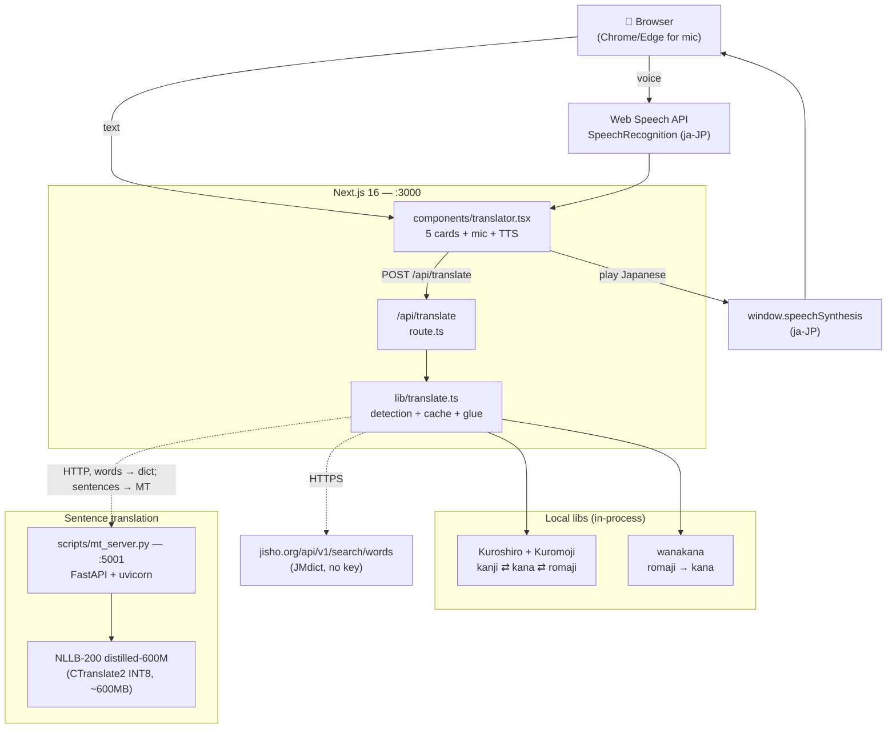

# Japanese Speech Companion

A FOSS Japanese ↔ English ↔ Romaji ↔ Hiragana ↔ Katakana mapper. Type or speak any of the five forms and see the rest. No commercial AI, no API keys at runtime, runs entirely on your own machine after install.

```
┌─ English ────────┐  ┌─ Japanese ───────┐  ┌─ Hiragana ───────┐
│ where is the     │  │ 空港はどこですか?  │  │ くうこうは        │
│ airport          │  │                  │  │  どこですか?       │
└──────────────────┘  └──────────────────┘  └──────────────────┘
┌─ Katakana ───────┐  ┌─ Romaji ─────────┐  ┌─ ▶ TTS ──────────┐
│ クウコウハ        │  │ kūkō wa doko     │  │ Play Japanese    │
│  ドコデスカ?      │  │  desu ka?        │  │ (browser)        │
└──────────────────┘  └──────────────────┘  └──────────────────┘
```

---

## 🧩 Architecture



Two services run locally:

| Service | Port | Process | When needed |
|---|---|---|---|
| Next.js dev | 3000 | `npm run dev` | Always |
| NLLB-200 MT server | 5001 | `npm run opus-mt` | Sentence translation only (word lookups hit Jisho directly) |

One external HTTPS dependency: `jisho.org` for word-level EN↔JA via JMdict. No keys, community-run, optional (the app gracefully degrades to MT-server-only if Jisho is unreachable).

---

## ⚙️ Minimum system requirements

| Component | Minimum | Recommended | Notes |
|---|---|---|---|
| OS | Windows 10 / macOS 12 / Ubuntu 20.04 | Windows 11 / Ubuntu 22.04+ | WSL2 works for Windows; install Node on the Windows side, MT server runs anywhere |
| CPU | 64-bit x86 / arm64, 2 cores | 4+ cores | NLLB-200 inference is CPU-bound. More cores = faster sentences. |
| RAM | 4 GB free | 8 GB | NLLB-200 CT2 INT8 holds ~600 MB; Node dev server ~500 MB |
| Disk | 3 GB free | 5 GB | ~1.3 GB HF cache + 600 MB CT2 model + 500 MB node_modules + misc |
| Node.js | 20 | 24 LTS | Tested on 24.15.0 |
| Python | 3.10 | 3.12+ | Only needed if you run the MT server. Tested on 3.13.0 |
| GPU | None | None | App is CPU-only by design; no CUDA needed |
| Network | Required at install | Once warm, optional | First start downloads ~1.3 GB of model weights; runtime calls to Jisho are optional |
| Browser | Any modern | Chrome / Edge | Mic input uses Web Speech API (Chrome/Edge only). TTS works everywhere. |

---

## 🚀 Quick install

### One-shot (recommended)

**WSL / Linux / macOS:**
```bash
./install.sh
```

**Windows PowerShell:**
```powershell
.\install.ps1
```

Both scripts check prerequisites, install Node + Python deps, and create `.env.local`. Re-runnable; idempotent. Pass `--skip-python` / `-SkipPython` to skip the MT-server deps if you only want word lookups.

### Manual

```bash
# Node side (Next.js, UI, API)
npm install
cp .env.local.example .env.local

# Python side (MT server, optional but recommended)
pip install -r requirements.txt
```

---

## 🏃 Running

```bash
# Terminal 1 — translation server (first start downloads ~1.3 GB)
npm run opus-mt

# Terminal 2 — Next.js dev
npm run dev
```

Open [http://localhost:3000](http://localhost:3000).

The MT server takes ~3 min on the first start (downloads NLLB-200 from Hugging Face and auto-converts it to a CTranslate2 INT8 model). Subsequent starts are ~5 seconds.

---

## 💡 How translation works

| Input shape | Path | Source of truth |
|---|---|---|
| Japanese with kanji/kana | Kuroshiro + Kuromoji generate hiragana + katakana + romaji from the input verbatim | in-process |
| Romaji (ASCII) | wanakana converts to kana, then Kuroshiro re-derives romaji/katakana; rule-based fix applies particle exceptions (`wa→は`, `o→を`, `e→へ`) | in-process |
| English, 1–3 words | Jisho.org JMdict API returns the JLPT-ranked common entry; Kuroshiro then expands kana/romaji | external HTTPS |
| English, 4+ words | NLLB-200 (via local MT server) returns idiomatic Japanese; Kuroshiro expands kana/romaji | local HTTP |

Input type is auto-detected. Ambiguous short ASCII inputs (e.g. `house` vs `ohayou`) trigger an async Jisho lookup to disambiguate.

In-memory cache keyed on NFKC-normalized input: ~100 ms on a hit, 0.9–2 s on a cold sentence translation.

---

## 🔌 API

The Next app exposes one route. Use it standalone:

```
POST /api/translate
Content-Type: application/json
{ "input": "<English | romaji | Japanese>" }
```

Returns:

```ts
{
  english: string;
  japanese: string;     // Hyōjungo, kanji+kana
  hiragana: string;     // hiragana only
  katakana: string;     // katakana only
  kana: string;         // legacy alias for hiragana
  romaji: string;       // Hepburn
  meta: {
    detected: "english" | "romaji" | "japanese";
    confidence: number;       // 0..1
    provider: string;         // e.g. "kuroshiro+jisho(common)", "kuroshiro+mt-server"
    cached: boolean;
    notes?: string[];
  };
}
```

`GET /api/translate` is a healthcheck. The MT server (`:5001`) exposes the same `/translate` shape as LibreTranslate, so you can swap it for any LibreTranslate-compatible backend.

---

## 📁 Project structure

| Path | Purpose |
|---|---|
| [`app/`](./app/) | Next.js App Router. `app/api/translate/route.ts` is the only server route. |
| [`components/translator.tsx`](./components/translator.tsx) | Client component — the entire UI. |
| [`lib/translate.ts`](./lib/translate.ts) | Detection, Kuroshiro/wanakana glue, MT-server client, in-memory cache. |
| [`lib/dictionary.ts`](./lib/dictionary.ts) | Jisho.org API client with JLPT-aware ranking and async tiebreaker. |
| [`scripts/mt_server.py`](./scripts/mt_server.py) | NLLB-200 CT2 translation server (FastAPI). |
| [`requirements.txt`](./requirements.txt) | Python deps for the MT server. |
| [`install.sh`](./install.sh) / [`install.ps1`](./install.ps1) | One-shot setup. |
| [`docs/`](./docs/) | Design spec + per-session handoff snapshots. |
| [`.claude/`](./.claude/) | Claude Code conventions and project skills (token-saving, branching, docs). |
| [`.AI-Agents/`](./.AI-Agents/) | Historical multi-provider design notes — **not** wired into the app. |

---

## ⚡ Translation quality vs. speed

The MT server's default `MODEL_NAME` is `facebook/nllb-200-distilled-600M` (CC-BY-NC 4.0). For commercial use, change it in [`scripts/mt_server.py`](./scripts/mt_server.py) and convert your replacement:

| Model | License | Quality | Approx size | Notes |
|---|---|---|---|---|
| **NLLB-200 distilled-600M (default)** | CC-BY-NC 4.0 | Best for short sentences | 1.3 GB raw / 600 MB INT8 | Multi-lingual but tuned to handle EN↔JA well |
| `staka/fugumt-en-ja` + `staka/fugumt-ja-en` | Apache 2.0 | Good, sometimes drops proper nouns | ~290 MB each | Pair of single-direction models |
| `Helsinki-NLP/opus-mt-en-jap` + `opus-mt-ja-en` | Apache 2.0 | Lower (2019 release) | ~290 MB each | Last-resort commercial option |

Measured latency on a typical dev laptop (no GPU):

| Path | Latency |
|---|---|
| Cache hit | ~100 ms |
| Word lookup (Jisho HTTPS) | 200–500 ms |
| Sentence (NLLB-200 CT2 INT8) | 0.9–2 s |
| Sentence (NLLB-200 PyTorch FP32, pre-optimization baseline) | 7–10 s |

---

## 🧠 Browser audio

- **Mic input** uses `window.SpeechRecognition` with `lang="ja-JP"`. Currently supported in Chrome and Edge; Firefox/Safari users see a clear "unsupported" message.
- **TTS playback** uses `window.speechSynthesis.speak()` with `lang="ja-JP"`. Voice quality varies by OS — best on macOS (Kyoko) and recent Windows (Haruka / Nanami).

---

## 🔐 Environment

The only env var the app reads is `LIBRETRANSLATE_URL`, set in `.env.local`. Default: `http://localhost:5001` (the bundled NLLB server). Point it at any LibreTranslate-compatible `/translate` endpoint if you want a different backend.

No commercial API keys are required at runtime. Files in this repo named `*_API_KEY` (Claude, OpenAI, Gemini, NVIDIA) are vestigial from earlier design exploration and **not used by the app** — see `.AI-Agents/` for historical context.

---

## 🧹 Disk cleanup after first install

After the first `npm run opus-mt`, two model copies sit in your HF cache:

- `~/.cache/huggingface/hub/models--facebook--nllb-200-distilled-600M/` (~1.3 GB) — original PyTorch weights, only needed for the one-time CT2 conversion.
- `~/.cache/nllb-200-ct2-int8/` (~600 MB) — the converted model the server actually uses.

Once the CT2 model exists, the PyTorch copy can be deleted to reclaim ~1.3 GB. The tokenizer files inside the HF cache (~10 MB) are still needed; deleting the whole `models--facebook--nllb-200-distilled-600M/snapshots/.../model.safetensors*` is the safer surgical option.

---

## 🛠 Development conventions

This repo uses [Claude Code](https://claude.com/claude-code) conventions:

- **Branching:** one feature branch per task, named `<type>/<short-kebab>` where `type ∈ {feat, fix, docs, chore, refactor, test, perf}`. See `.claude/skills/new-task-branch/`.
- **Token-saving:** all shell commands are prefixed with [`rtk`](https://github.com/rtk-ai/rtk) to compress tool output by 60-90% before it reaches the model context. See `.claude/CLAUDE.md`.
- **Docs sync:** README + CHANGELOG + `.claude/CLAUDE.md` stay aligned per the `docs` skill.

For contributors, see [`CONTRIBUTING.md`](./CONTRIBUTING.md).

---

## 📜 Licenses

- This project: see [`LICENSE`](./LICENSE) if present, otherwise contact the repo owner.
- Kuroshiro, Kuromoji, wanakana, sentencepiece: MIT / Apache 2.0.
- Jisho.org's JMdict data: CC BY-SA 4.0 (data); API usage is free for non-abusive personal/educational traffic.
- NLLB-200 weights: CC-BY-NC 4.0 (non-commercial). See "Translation quality vs. speed" above for Apache-2.0 alternatives.
- LibreTranslate (alternative backend): AGPLv3.

---

## 🚀 Deploy on Vercel

The Next.js app deploys on Vercel out of the box. The MT server does not — it needs ~600 MB of model state and a persistent Python process, neither of which fits a serverless function. For a production deploy, host the MT server on a small VM (1 vCPU + 2 GB RAM suffices) and set `LIBRETRANSLATE_URL` in Vercel env to point at it.

See [Next.js deployment docs](https://nextjs.org/docs/app/building-your-application/deploying) for the app side.
